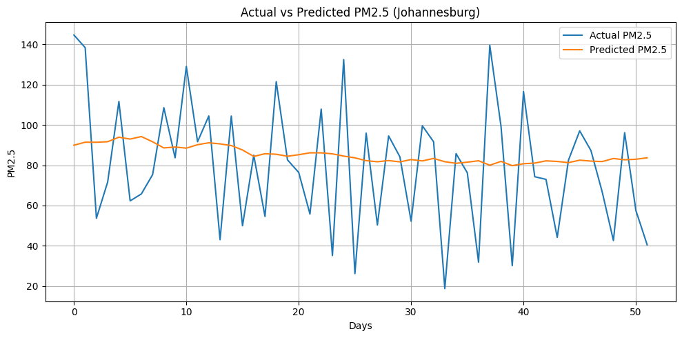
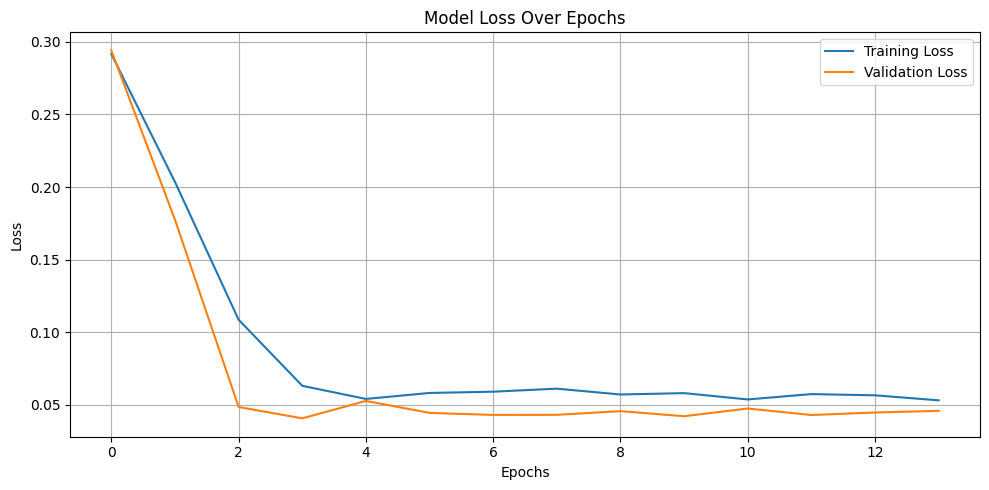
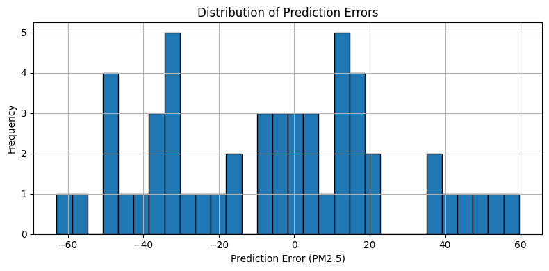

# Johannesburg_PM25_LSTM

This repository contains the code and supplementary files for the MSc dissertation:  
*"Forecasting PM2.5 in Johannesburg Using LSTM: Building on Peer-Reviewed Models for Air Quality in the Global South."*

## Overview
The project uses a Long Short-Term Memory (LSTM) neural network to forecast PM2.5 concentrations in Johannesburg. It builds upon the methodology and code from Masinde et al., 2024 (Nairobi dataset).

## Contents
- Jupyter Notebook with LSTM model
- Sample dataset / Kaggle link
- Dissertation PDF
- Figures and appendix

## Graphs

### Actual vs Predicted PM2.5 (Johannesburg)

### Model Loss Over Epochs

### Distribution of Prediction Errors

## Citation
If you use this code, please cite:  
Masinde, A.W., Mwaniki, P.M. and Mwaniki, J.I. (2024) 'Leveraging long short term memory in air pollution prediction in Nairobi', *Mathematics Journal*, 9(5), Part B, pp. 160–164. https://doi.org/10.22271/maths.2024.v9.i5b.1856

## Dataset
Global air quality dataset (10,000 rows) available on Kaggle:  
[https://www.kaggle.com/datasets/waqi786/global-air-quality-dataset]
